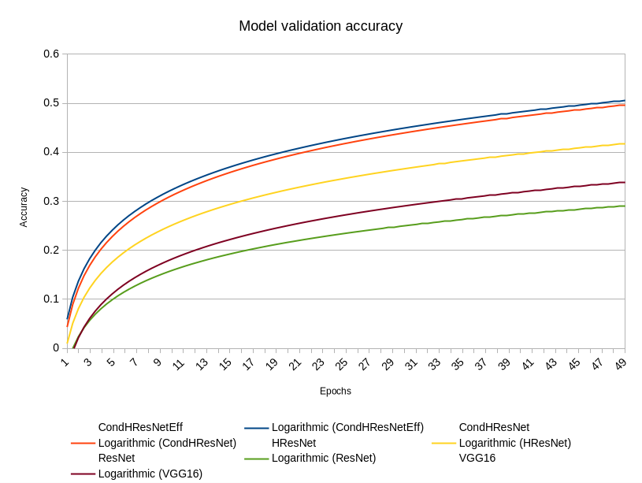

# Hierarchical-Classification

## Overview
This project consists of the implementation of several hierarchical classification models. The goal is to classify images into a hierarchical structure, where each class has a parent class. The dataset used is the ImageNet dataset, which consists of 1000 classes. The hierarchical structure has been extracted from WordNet.

## Implemented Models
We implemented the following models:
- **VGG16​**: based on the [original paper](https://arxiv.org/abs/1409.1556)
- **HVGG16​** and **HVGG11**: based on the [original paper](https://doi.org/10.1016/j.eswa.2018.09.022)
- **ResNet50​**: based on the [original paper](https://arxiv.org/abs/1512.03385)
- **CondResNet50**: based on the [original paper](https://doi.org/10.48550/arXiv.1904.04971)
- **HResNet​50**: based on ResNet50, but with hierarchical classification as in HVGG16
- **Branch Selection ResNet​50**: based on ResNet50, but with branch selection mechanism based on the coarse prediction
- **CondHResNet50**: based on HResNet50, but with conditionally parameterized convolutions

## Evaluation
Here we can see the validation accuracy over training time (50 epochs) of the ResNet50-based models:


## Setup
Install the conda environment using the environment.yml file:
```
conda env create -f environment.yml
```

## Dataset
Download the data from [here](https://image-net.org/challenges/LSVRC/2012/2012-downloads.php) and extract it to the `dataset/` folder.

Now you can run the `xml_extractor.py` to correctly organize the validation data:
```
python -m moduels.utils.xml_extractor
```

Now you should have the following folder structure:
```
dataset/
    train/
        n01440764/ # e.g. synset
            n01440764_10026.JPEG # e.g. image
            ...
    val/
        n01440765/ # e.g. synset
            n01440765_10026.JPEG # e.g. image
            ...
    test/
        n01440766/ # e.g. synset
            n01440766_10026.JPEG # e.g. image
            ...
    hierarchy.csv
    val_mapping.csv
```

## Training
To train the model, run the `run.py` file:
```
python run.py
```